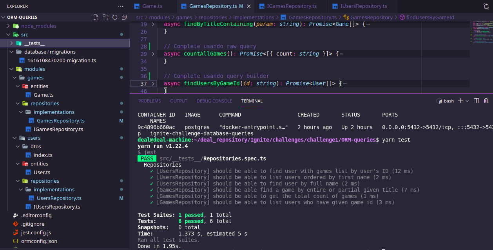

# 
 ORM-queries

TypeORM: using an Object-relational mapping with query builder and raw query. :white_check_mark:

  
<h3>To run :electric_plug:</h3>
<h4>First you need to create a container with database, follow the command and paste it in terminal. :heavy_exclamation_mark:</h4>
<strong><h5 align="center">docker run --name ignite-challenge-database-queries -e POSTGRES_DB=queries_challenge -e POSTGRES_PASSWORD=docker -p 5432:5432 -d postgres</h5></strong>
  
:heavy_plus_sign: Using the TypeORM and Repository
 
:heavy_plus_sign: Using Query Builder
 
:heavy_plus_sign: Using Raw Query
  
<h3>Tests descriptions</h3>
 
<ul>
  <li>should be able to find user with games list by user's ID :heavy_check_mark:</li>
  <li>should be able to list users ordered by first name :heavy_check_mark:</li>
  <li>should be able to find user by full name :heavy_check_mark:</li>
  <li>should be able find a game by entire or partial given title :heavy_check_mark:</li>
  <li>should be able to get the total count of games :heavy_check_mark:</li>
  <li>should be able to list users who have given game id :heavy_check_mark:</li>
</ul>
  

